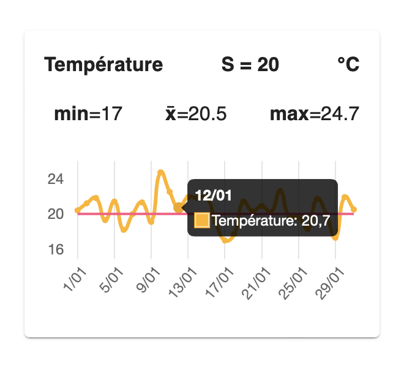
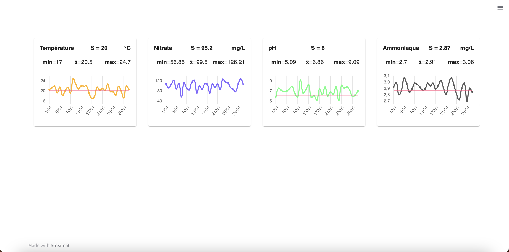

# Streamlit LChart Card

## Installation

Install the package with the following command :
```
pip3 install streamlit_lchart_card
```

You can use Python>=3.6 and Streamlit to use this component.

## Definition

Streamlit component using Chartjs/React/MUI to display dataframe numeric data into a line chart.
<div style='text-align: center;'>
    
    <p>Chart card example</p>
</div>
Xaxis can be either numeric|string|Date object. For my personal usage, I removed year information from dates.

It is advisable to use wide layout in streamlit configuration with the following statement :
```
import streamlit as st

st.set_page_config(layout="wide")
```

As I'm not a pro in frontend, I used fixed size for this component (h=250px, w=290px). You can display up to 4 cards in one row with ````st.columns()````. An example is given in **example.py**.
<div style='text-align: center;'>
    
    <p>4 Chart cards</p>
</div>

## Arguments

| **Argument** | **Description**                                                                                                                                                                                       | **Default value**   |
|--------------|-------------------------------------------------------------------------------------------------------------------------------------------------------------------------------------------------------|---------------------|
| title        | Left-up label of Component.                                                                                                                                                                           | [REQUIRED VALUE]    |
| df           | Dataframe where the displayed data come from.                                                                                                                                                         | [REQUIRED VALUE]    |
| x            | Column label for xaxis data.                                                                                                                                                                          | [REQUIRED VALUE]    |
| y            | Column label for yaxis data.                                                                                                                                                                          | [REQUIRED VALUE]    |
| labels       | Xaxis and Yaxis to display in Component chart. Format : { \<key\>: \<value\> } with key referring to x or y label, value referring to the string to display. Example : { "date": "Date", "pH": "pH" } | [REQUIRED VALUE]    |
| defaultColor | Color or the line and markers. Format : string with rgb or HEX value. Example : "rgb(255, 0, 0)" or "#FF0000".                                                                                        | "rgb(0, 0, 255)"    |
| thresh       | Numeric threshold to display in chart.                                                                                                                                                                | None                |
| threshColor  | Color of the threshold line.                                                                                                                                                                          | "rgb(255, 90, 132)" |
| key          | Key of the component. Must be declare to avoid issue.                                                                                                                                                 | None                |

## Notes

I may not update this component. I do this for personal purpose only. However, you can suggest ideas, if it doesn't take too much time I'll consider modifying this work.